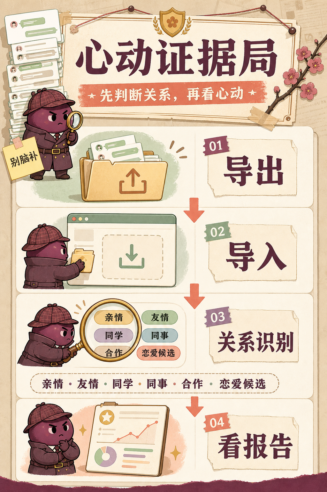
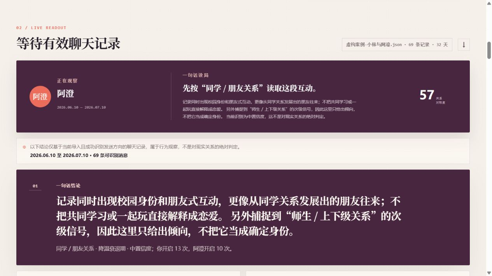
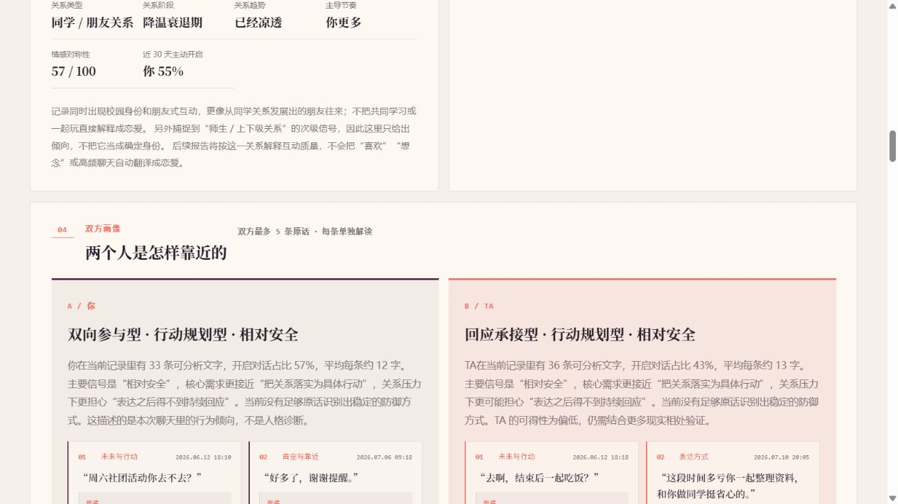
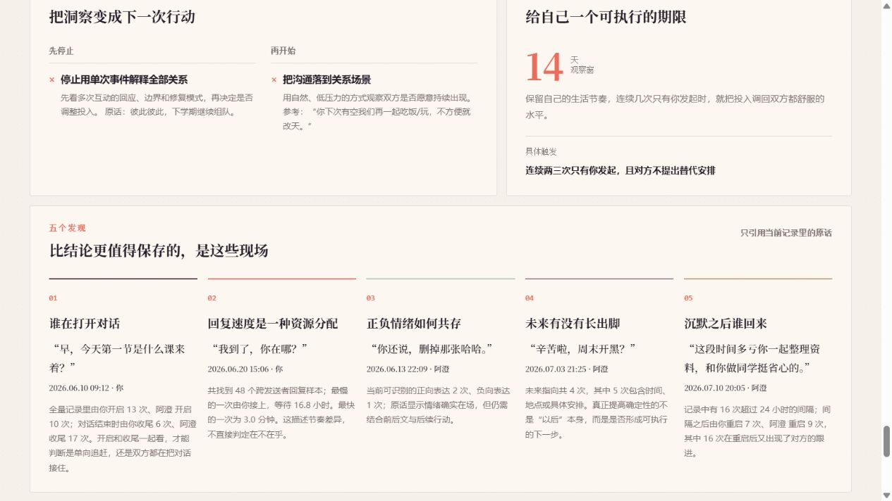
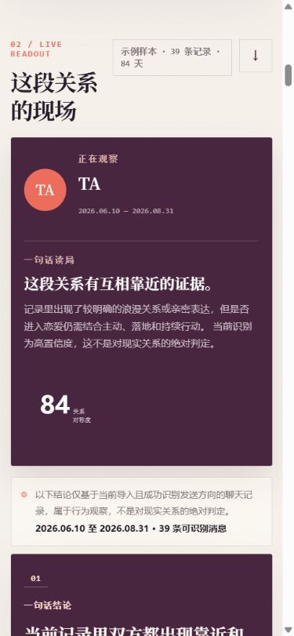

# 心动证据局

一个浏览器内运行的聊天关系分析台原型。它借鉴了 `863401402/she-love-me` 的“统计层 + 证据层”思路，但从零实现了一个更轻量的前端版本：不依赖后端，不上传聊天记录，打开 `index.html` 即可体验。

> 它不能替你脱单，但能在你准备把一句“哈哈”解读成“她是不是喜欢我”之前，先递上一张统计表。


心动证据局把聊天记录拆成三层：先看谁在开启和回应，再回到真实原话，最后把观察转成下一步行动。它不替用户编故事，也不把普通朋友、家人或同学聊天强行套进恋爱模板。

## 已实现

- JSON 导入：支持数组，或 `{ "messages": [...] }` 结构
- 文本导入：`[2026-08-12 20:10] 我: 消息内容`
- 时间戳归一化：秒、毫秒与常见日期文本
- 互动统计：消息量、对话发起、回复速度、连续发送、沉默后修复
- 透明评分：主动投入、被回应感、冷淡信号、关系对称度
- 证据回放：从记录里选出可回看的关键原话
- 多维报告：先根据关系称谓、身份和场景信号识别亲情、同学 / 朋友、同事 / 合作、师生 / 上下级、浪漫关系候选或待确认关系，再按“结论 → 关系识别 → 数据概览 → 双方画像 → 互动结构 → 互动维度参考 → 风险预警 → 关系军师 → 最终结论”分模块呈现
- 关系识别带高 / 中 / 低置信度和原文信号；只有浪漫关系候选才把 Sternberg、恋爱风险等内容作为主分析，避免把普通朋友、亲情和事务聊天套成恋爱报告
- 本地摘要下载：生成 `.txt` 文件
- 文件夹化导出说明：在 `导出工具/` 中分别提供微信与 QQ 的导出路径、官方工具、版本校验值、导入格式和隐私提醒
- 响应式界面、键盘焦点、减少动态效果支持

## 运行

Windows 用户直接双击 `启动心动证据局.cmd`，程序会用电脑默认浏览器打开分析页面；也可以直接双击 `index.html`。分析页面只使用浏览器内置的 HTML、CSS、JavaScript 和 FileReader，不需要安装 Python、Node.js、npm 或启动后端服务。

本项目的分析页不依赖网络、外部字体或 CDN。微信与 QQ 的导出工具是独立的 Windows EXE，只在需要从对应平台导出聊天记录时使用。

## 手机端

页面已经适配手机浏览器：电脑上的双栏报告会自动变成单列阅读，输入框、文件选择、下载摘要和关系画像卡片都针对触摸操作做了放大和换行处理。发布到 GitHub Pages 后，手机用 Edge、Chrome 或 Safari 打开网址即可分析 JSON / TXT 文件，聊天内容仍只在当前设备的浏览器中读取。

页面同时附带 `app.webmanifest` 和离线缓存脚本。在支持 PWA 的浏览器中，首次在线打开后可以添加到手机桌面；之后页面资源可以在无网络时继续打开。手机不运行微信或 QQ 导出 EXE，导出步骤仍在 Windows 电脑上完成。

## 页面预览

### 先判断关系，再开始解释



### 真实页面效果：关系识别

以下截图来自虚构案例导入后的真实运行结果，展示的是程序实际生成的关系识别模块，不是静态设计稿。



### 真实页面效果：双方画像

双方各保留最多 5 条当前记录中的原话，并对每条证据单独解释。



### 真实页面效果：五个发现



### 手机端真实效果



## 先导出，再分析

本项目不直接连接 QQ 或微信客户端，也不读取、解密聊天数据库。请先使用对应平台的导出工具生成 JSON / TXT，再把文件拖入页面。

- 微信：使用你指定的 [wechat-chat-export](https://github.com/zhuzhangxue/wechat-chat-export) Windows EXE，本包已附 v1.3.0。详细说明见 [导出工具/微信/使用说明.md](导出工具/微信/使用说明.md)。
- QQ：本包已附 QQ Chat Exporter 官方 Windows x64 安装包，也可从 [官方 Releases](https://github.com/shuakami/qq-chat-exporter/releases/latest) 更新。详细说明见 [导出工具/QQ/使用说明.md](导出工具/QQ/使用说明.md)。

项目文件夹中附带两个官方发布物的原样 Windows 安装包，位于 `导出工具/微信/` 和 `导出工具/QQ/`。它们不参与本页面运行，用户需要先自行安装并导出 JSON / TXT；版本、来源和 SHA-256 已记录在 `导出工具/README.md`。

源码仓库不会把 Windows EXE 和离线压缩包作为普通 Git 文件提交：GitHub 对单个普通文件有大小限制，且导出工具应始终从官方 Release 获取。需要完整“解压即用”包时，应把 `心动证据局-离线发布包.zip` 作为 GitHub Release 附件发布；GitHub Pages 则直接托管本仓库的手机和电脑网页端。

## 输入格式

如果导入的微信类 JSON 没有直接提供 `sender: "me"/"them"`，页面会优先识别 `isSend`、`is_send`、`is_sender`、`direction`、`isSelf`、`senderUsername`、`own_wxid`、`ownerId` 等常见字段，并自动提取双方昵称。消息类型不是严格的 `text` 时，只要记录里仍有正文，也会纳入文本分析。若只有两个昵称、没有任何本人标记，页面会列出候选并让你选择“哪个是我”，不会凭空猜测发送方向；选择后会立即重新分析。

微信记录中的名片、公众号、小程序和链接卡片有时会以 `<msg ...>` / `<appmsg ...>` XML 保存。页面会把这类内部载荷识别为结构化消息，只提取可读标题，不会把头像 URL、alias、地区等 XML 属性当成聊天原话或关系证据。

最小 JSON 示例：

```json
{
  "contact": "小王",
  "messages": [
    {"timestamp": "2026-08-12 20:10", "sender": "me", "content": "今天见到你很开心"},
    {"timestamp": "2026-08-12 20:12", "sender": "them", "content": "我也是"}
  ]
}
```

## 和原项目的关系

原项目更像一个“数据采集与模型分析工作流”：通过第三方导出工具拿到微信/QQ记录，转换成统一 `messages.json`，用 Python 统计脚本生成 `stats.json`，再从起源、冲突、最近 30 天和修复时刻抽取样本，交给 Agent 结合心理学框架写 HTML 报告。

这个版本实现了其中可以在浏览器本地透明复核的部分，并把原项目的多元报告结构改造成可逐模块阅读的确定性启发式报告。它先做关系类型分流，再解释互动，不会因为消息多、回复快或出现“喜欢”等单个词就直接判定恋爱。它不接入微信解密、QQ 导出器本机 API 或外部大模型；“依恋倾向”“情感可得性”和“风险雷达”只展示可观察信号，不是心理诊断。报告中的原话只从当前成功导入的数据中选择；解析失败会清空旧报告，避免把内置示例误显示成用户证据。后续接入模型时，仍应强制每条推断关联时间戳证据。

## 隐私边界

当前页面只使用浏览器 FileReader、DOM 和本地计算；聊天内容不会通过代码主动发送到服务器，样式也不依赖外部字体或 CDN。
